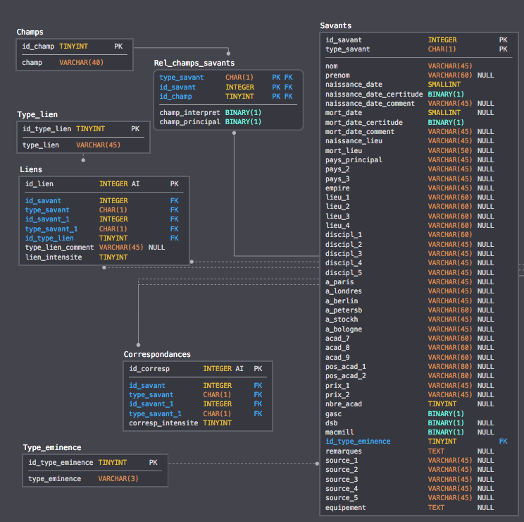

# Base de données sur les savants de la période 1700-1870 (René Sigrist)

Une partie de la base de données, initialement crée en FileMaker Pro, a été migrée en SQL.
Cette "nouvelle" base de données, en l'état à la date du 14 août 2020, a été déposée sur Zenodo.
Pour accéder et/ou citer ce dépôt:

> Sigrist, R. (2020), Base de données sur les savants de la période 1700-1870 [Dataset]. 
Zenodo. DOI:[10.5281/zenodo.3956437](https://doi.org/10.5281/zenodo.3956437).

Pour citer cette base de données dans sa forme d'origine (en FileMaker Pro):

> Sigrist, R. (2017), The rise of "academic science" in Europe, 1700-1870: A demographic and geographic approach. 
*Annali di Storia delle Università Italiane*, 21, p. 203-243.

## Contenu du dépôt Git

- Les données exportées de FileMaker Pro en html (dossier [`DATA`](/DATA))
- Les codes pour migrer les données des fichiers en html vers SQL
- Les données en SQL, ainsi que le modèle relationnel (dossier [`data_for_sql`](/data_for_sql))

## Crédits

Cette migration fait partie du projet [*Promoting Knowledge. 
The Origins of the Science System and the Making of Professional Structures in
European States, 1700-1870*](http://p3.snf.ch/Project-166345) financé par le Fonds National Suisse de la Recherche Scientifique (n° 166345).

Créateur de la base de données et collecte des données: René Sigrist

Chef de projet: Dominique Vinck

Migration des données vers SQL: Christelle Cocco